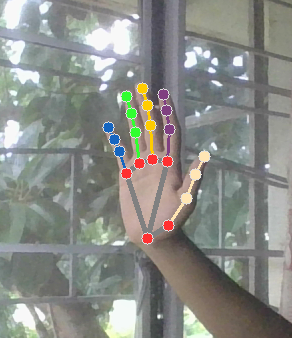

# Hand Counter

This script uses mediapipe library from google to count the number of fingers/thumbs that are up.

It also works with multiple hands

### Python Dependencies:

- mediapipe
- opencv-python

### Example:

